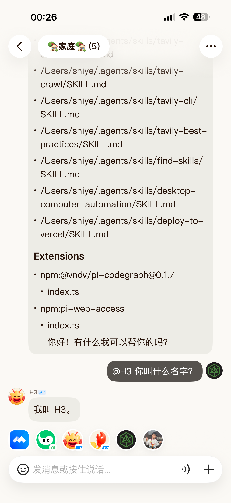

# 元宝 ACP

[](https://www.npmjs.com/package/yuanbao-acp)

将元宝桥接到任意 ACP 兼容的 AI 智能体。

`yuanbao-acp` 通过元宝机器人 API 登录，轮询接收到的消息，将其通过 stdio 转发到 ACP 智能体，并将智能体的回复发送回元宝。



## 元宝与微信对比

| 特性                 | 微信                      | 元宝                                 |
| -------------------- | ------------------------- | ------------------------------------ |
| **无需额外安装 App** | ✅ 用户已安装微信，门槛低  | ❌ 需安装元宝 App                     |
| **机器人可加入群聊** | ❌ 机器人无法加入微信群    | ✅ 机器人可加入群聊，多人协作         |
| **多机器人支持**     | ❌ 仅支持单一公众号/服务号 | ✅ 可添加多个机器人，满足不同场景需求 |


**总结：** 如果你追求开箱即用、用户无需额外安装，微信是更好的选择；如果你需要机器人进入群聊、支持多机器人协作、以及深度 AI 能力，元宝更具优势。

## 致谢

感谢 [formulahendry](https://github.com/formulahendry) 和 [YuanbaoTeam](https://github.com/YuanbaoTeam) 提供的代码参考。

## 功能特性

- 内置常见 agent 的 ACP 智能体预设
- 自定义原始智能体命令支持
- 自动允许智能体的权限请求
- 支持私聊、群聊
- 后台守护进程模式

## 环境要求

- Node.js 20+
- 已安装元宝APP
- 本地或通过 `npx` 可用的 ACP 兼容智能体

## 快速开始

你需要从元宝APP获取 **应用 ID** 和 **应用密钥**。通过 CLI 参数、环境变量或配置文件传递（详见 [CLI 用法](#cli-用法) 和 [配置文件](#配置文件)）。

```bash
npx -y yuanbao-acp@latest --agent copilot \
  --yuanbao-app-id YOUR_APP_ID \
  --yuanbao-app-secret YOUR_APP_SECRET
```

或通过环境变量：

```bash
export YUANBAO_APP_ID=YOUR_APP_ID
export YUANBAO_APP_SECRET=YOUR_APP_SECRET
npx -y yuanbao-acp@latest --agent copilot
```

或使用自定义原始命令：

```bash
npx -y yuanbao-acp@latest --agent "npx my-agent --acp" \
  --yuanbao-app-id YOUR_APP_ID \
  --yuanbao-app-secret YOUR_APP_SECRET
```

## 尝试预览版本

每次推送到 `main` 分支都会自动以 `next` 发布标签发布到 npm，因此你可以在等待正式版本之前试用未发布的更改：

```bash
npx -y yuanbao-acp@next --agent copilot
```

这些版本的标签格式为 `<base>-next.<UTC时间戳>.<短SHA>`（例如 `0.7.1-next.202605311530.abc1234`，其中 `0.7.1` 是当前 `@latest` 之上的下一个补丁版本）。它们来自 CI 通过后的 `main` 分支构建，但尚未经过发布审核 —— 可能仍有粗糙之处。稳定用户请继续使用 `yuanbao-acp@latest`。

## 内置智能体预设

列出内置预设：

```bash
npx yuanbao-acp agents
```

当前预设：

- `copilot`
- `claude`
- `gemini`
- `qwen`
- `codex`
- `opencode`
- `openclaw`
- `kiro`
- `hermes`
- `kimi`
- `pi`

这些预设在内部解析为具体的 `命令 + 参数` 对，因此用户无需输入冗长的 `npx ...` 命令。

## CLI 用法

```text
yuanbao-acp --agent <preset|command> [options]
yuanbao-acp agents
yuanbao-acp inject --text <text>
yuanbao-acp stop
yuanbao-acp status
```


Options:

- `--agent <value>`: built-in preset name or raw agent command
- `--cwd <dir>`: working directory for the agent process
- `--login`: force QR re-login and replace the saved token
- `--daemon`: run in background after startup
- `--config <file>`: load JSON config file
- `--instance <name>`: run as a named, isolated instance. See "Running multiple instances" below.
- `--yuanbao-app-id <id>`: YuanBao app ID (**required**). Also via env `YUANBAO_APP_ID` or config `yuanbao.appId`.
- `--yuanbao-app-secret <secret>`: YuanBao app secret (**required**). Also via env `YUANBAO_APP_SECRET` or config `yuanbao.appSecret`.
- `--yuanbao-bot-id <id>`: YuanBao bot ID (auto-detected from sign-token if omitted). Also via env `YUANBAO_BOT_ID`.
- `--yuanbao-ws-url <url>`: YuanBao WebSocket URL (default: `wss://bot-wss.yuanbao.tencent.com/wss/connection`). Also via env `YUANBAO_WS_URL`.
- `--yuanbao-api-domain <url>`: YuanBao API domain (default: `https://bot.yuanbao.tencent.com`). Also via env `YUANBAO_API_DOMAIN`.
- `--yuanbao-route-env <env>`: YuanBao route env. Also via env `YUANBAO_ROUTE_ENV`.
- `--idle-timeout <minutes>`: session idle timeout, default `1440` (use `0` for unlimited)
- `--max-sessions <count>`: maximum concurrent user sessions, default `10`
- `--inbox-dir <dir>`: directory where received binary files are saved (default: `<storage.dir>/inbox`). The agent sees the absolute saved path in the prompt and can read the file directly.
- `--no-inbox`: do not save received files; the agent only sees a size notice.
- `--hide-thoughts`: do not forward agent thinking to YuanBao (default: forwarded)
- `--show-diffs`: forward ACP file diffs to YuanBao (default: hidden)
- `inject --text <text>`: enqueue a local text message for the running daemon
- `-V, --version`: print version and exit
- `-h, --help`: show help 

当通过多种方式提供相同参数时，CLI 参数优先级高于环境变量，环境变量优先级高于配置文件。

示例：

```bash
npx -y yuanbao-acp@latest --agent copilot
npx -y yuanbao-acp@latest --agent claude --cwd D:\code\project
npx -y yuanbao-acp@latest --agent "npx @github/copilot --acp"
npx -y yuanbao-acp@latest --agent gemini --daemon
```

## 运行多个实例

默认情况下，所有内容（保存的登录令牌、守护进程 PID/日志、同步状态、遥测 ID）都存储在 `~/.yuanbao-acp/` 下，这意味着一台机器只能同时托管一个桥接服务。传入 `--instance <名称>` 将所有内容命名空间到 `~/.yuanbao-acp/instances/<名称>/` 下，并排运行多个桥接服务，每个都有自己的元宝账号和项目目录。

典型设置：元宝账号 1 驱动项目 A，元宝账号 2 驱动项目 B。

```bash
# 终端 1: 元宝Bot1
npx -y yuanbao-acp@latest --instance projA --agent copilot --cwd D:\code\repo-a

# 终端 2: 元宝Bot2
npx -y yuanbao-acp@latest --instance projB --agent copilot --cwd D:\code\repo-b
```


`stop` 和 `status` 子命令也支持 `--instance`：

```bash
npx -y yuanbao-acp@latest status --instance projA
npx -y yuanbao-acp@latest stop   --instance projB
```

不使用 `--instance` 时，路径回退到 `~/.yuanbao-acp/`，与之前完全相同，因此现有安装不受影响。

## 配置文件

你可以使用 `--config` 提供 JSON 配置文件。

示例：

```json
{
  "yuanbao": {
    "appId": "YOUR_APP_ID",
    "appSecret": "YOUR_APP_SECRET"
  },
  "agent": {
    "preset": "copilot",
    "cwd": "D:/code/project",
    "showDiffs": true
  },
  "session": {
    "idleTimeoutMs": 86400000,
    "maxConcurrentUsers": 10
  }
}
```

你也可以覆盖或添加智能体预设：

```json
{
  "agent": {
    "preset": "my-agent"
  },
  "agents": {
    "my-agent": {
      "label": "我的智能体",
      "description": "内部团队智能体",
      "command": "npx",
      "args": ["my-agent-cli", "--acp"]
    }
  }
}
```

## 自定义桥接命令名称（别名）

桥接斜杠命令如 `/acp-config` 和 `/acp-cancel` 具有固定的内置名称，对每个人来说可能不够自然，且可能与底层智能体内置的斜杠命令冲突。你可以通过 `commandAliases` 配置映射将任何桥接命令映射到一个或多个自定义别名：

```json
{
  "commandAliases": {
    "/acp-cancel": ["/cancel", "/取消", "取消"],
    "/acp-config": ["/config", "/设置"]
  }
}
```

有了此配置：

- 发送 `/取消` 取消当前回合（与 `/acp-cancel` 相同），并且 `/取消 all` 的行为类似于 `/acp-cancel all`。
- 发送 `/设置` 列出 ACP 会话配置（与 `/acp-config` 相同），并且 `/设置 set <配置ID> <值>` 的行为类似于 `/acp-config set ...`。
- 原始内置名称始终作为回退保持可用。

支持两种别名风格：

- **斜杠别名**（以 `/` 开头，例如 `/cancel`）的行为与内置命令相同：它们匹配命令 token 且后面可跟参数（`/cancel all`）。不能包含空白字符。
- **裸短语别名**（无前导 `/`，例如 `取消`）仅在它们等于*完整*消息时匹配。这对于元宝语音输入很有用，因为大声说出 `/取消` 不太自然 —— 转录后的 `取消` 会触发命令。由于它们需要完整的精确消息匹配，因此不接受参数。

注意：

- 键必须是已知的桥接命令（`/acp-config`、`/acp-cancel`、`/acp-prompt-start` 或 `/acp-prompt-done`）。
- 别名不能与内置命令名称冲突，也不能映射到多个命令。无效的配置将在启动时被拒绝。

## 运行时行为

- 每个元宝Bot获得一个专用的 ACP 会话和子进程。
- 消息按用户串行处理。
- 回复在发送前格式化为元宝支持的格式。
- 当元宝 API 支持时会发送打字指示器。
- 不活跃后清理会话（将 `idleTimeoutMs` 设置为 `0` 可禁用空闲清理）。

## 元宝 ACP 配置命令

`yuanbao-acp` 保留了一个桥接级别的聊天命令，用于检查和修改 ACP 会话配置，而无需在元宝中暴露 UI 选择器：

```text
/acp-config
/acp-config set <configId> <value>
```

示例：

```text
/acp-config
/acp-config set model gpt-5-mini
/acp-config set mode plan
/acp-config set reasoning_effort low
```

注意：

- 该命令仅在元宝用户已有活动的 ACP 会话后生效。如果没有，先发送一条普通消息以创建会话。
- 可用的 `配置ID` 值直接来自 ACP 智能体的 `configOptions`，因此确切列表取决于配置的智能体。
- 此命令由 `yuanbao-acp` 本身处理，**不会**转发到底层智能体。
- 你可以通过 `commandAliases` 为此命令设置自己的别名（见 [自定义桥接命令名称](#自定义桥接命令名称别名)）。

## 元宝 ACP 取消命令

元宝不提供用于停止进行中的智能体回合的停止按钮，因此桥接暴露了一个聊天命令：

```text
/acp-cancel
/acp-cancel all
```

行为：

- `/acp-cancel` 向智能体发送 `session/cancel` 以取消当前回合。进行中的 `prompt()` 以 `stopReason: "cancelled"` 解析，任何已流式传输的部分输出会发送给元宝并附带 `[已取消]` 后缀，下一个排队消息（如果有）按常规处理。
- `/acp-cancel all` 执行相同操作，并丢弃当前回合之后排队的每条消息。等待那些排队消息的本地注入（`yuanbao-acp inject`）将被拒绝。
- 如果没有回合在进行中，命令回复通知并作为空操作。
- 此命令由 `yuanbao-acp` 本身处理，**不会**转发到底层智能体。
- 你可以通过 `commandAliases` 为此命令设置自己的别名（见 [自定义桥接命令名称](#自定义桥接命令名称别名)）。

## 多部分消息缓冲

元宝不允许在单条消息中发送图片、文件和文本。为解决此问题，桥接提供了缓冲模式，收集多条消息并将其作为一条组合请求发送给智能体：

```text
/acp-prompt-start
/acp-prompt-done
```

用法：

1. 发送 `/acp-prompt-start` 进入缓冲模式。桥接回复确认信息。
2. 按任意顺序发送任意数量的消息（文本、图片、文件）。这些会在本地收集，**不会**转发给智能体。
3. 发送 `/acp-prompt-done` 刷新缓冲区。所有收集的内容合并为单个智能体请求。

这避免了在用户需要发送混合内容时触发多个智能体回合（和多个回复）。

- 如果在缓冲区为空时发送 `/acp-prompt-done`，桥接回复警告且不发出智能体请求。
- 如果已在缓冲时发送 `/acp-prompt-start`，桥接提醒用户并保持现有缓冲区。
- 缓冲是按用户的，保存在内存中。不会在桥接重启后持久化。
- 缓冲区在 10 分钟不活跃后过期。每个缓冲区最多可收集 50 个内容块。
- 此命令由 `yuanbao-acp` 本身处理，**不会**转发到底层智能体。

## 本地注入消息

`yuanbao-acp inject` 允许本地自动化为正在运行的守护进程排入一条文本消息。守护进程将其视为来自目标用户的传入私聊消息，发送给配置的 ACP 智能体，并通过元宝回复。

这对于 cron 或 launchd 任务很有用，例如每日 AI 新闻提示：

```bash
npx yuanbao-acp inject --instance main --text "今日 AI 资讯"
```

目标：

- 默认目标: `last-active-user`
- 自定义目标: `--to <元宝用户ID>`

守护进程从真实的传入元宝消息中学习 `last-active-user`，并在实例存储目录下存储最新的 `userId + contextToken`。如果尚无用户向机器人发送过消息，请让目标用户先发送任意消息，然后重试注入。

注入的消息以下列 JSON 文件形式存储：

```text
~/.yuanbao-acp/inject/
~/.yuanbao-acp/instances/<name>/inject/
```

队列基于文件：

```text
inject/
├── pending/
├── processing/
├── done/
└── failed/
```

`inject` 仅写入 `pending/`；守护进程在处理过程中将文件移动到其他目录。如果守护进程未运行，消息将保持排队状态，待守护进程启动后处理。

对于较长的提示，使用文件：

```bash
npx yuanbao-acp inject --instance main --file ./prompt.txt
```

Linux cron 条目示例：

```cron
0 7 * * * /usr/local/bin/yuanbao-acp inject --instance main --text "今日 AI 资讯"
```

## 接收文件

当元宝用户发送二进制文件（PDF、图片、导出为文件的音频录音、ZIP 等）时，`yuanbao-acp` 会从元宝 CDN 下载并解密文件，然后**保存到磁盘**，以便 ACP 智能体通过绝对路径读取。智能体会收到类似这样的文本块：

```
[收到文件: 报告.pdf (484067 字节) — 保存至: /Users/me/.yuanbao-acp/inbox/2026-05-21T09-29-12-492Z-报告.pdf]
```

任何能读取本地文件的 ACP 智能体（Copilot CLI、Claude Code、Codex 等）都可以使用其正常的文件工具打开保存的路径。

默认值：

- 保存位置: `<storage.dir>/inbox`，即默认 `~/.yuanbao-acp/inbox`，或使用 `--instance` 时为 `~/.yuanbao-acp/instances/<name>/inbox`。
- 文件名: `<ISO时间戳>-<原始文件名>`，原始文件名中的文件系统不安全字符会被替换为 `_`。Unicode（包括中文）文件名会被保留。
- 无自动清理。文件会一直存在直到你删除它们；智能体可能在元宝消息到达很久之后仍引用它们。如果你想定期清理，可运行例如 `find ~/.yuanbao-acp/inbox -mtime +30 -delete`。

覆盖选项：

- `--inbox-dir /some/path` — 将文件写入其他位置（如果你想将它们放在 iCloud Drive、项目文件夹等地方很有用）
- `--no-inbox` — 保留 0.3 之前的行为，即下载后丢弃文件缓冲区，智能体仅看到 `[收到文件: 名称, N 字节]`。

文本类型文件（`.md`、`.json`、源代码等）和图片保持之前的行为：它们的内容以内联方式嵌入到提示中作为 `resource` / `image` 块，无需写入磁盘。

## 存储

默认情况下，运行时文件存储在以下位置：

```text
~/.yuanbao-acp
```

此目录用于：

- 保存的登录令牌
- 守护进程 PID 文件
- 守护进程日志文件
- 同步状态
- 匿名遥测安装 ID（`telemetry-id`，见遥测部分）
- `inbox/` — 从元宝接收的二进制文件（见"接收文件"）；可通过 `--no-inbox` 禁用或通过 `--inbox-dir` 重新定位
- `state.json` — 最后活跃用户和本地注入的上下文令牌
- `inject/` — 本地注入消息队列

使用 `--instance <名称>` 时，相同的文件存储在 `~/.yuanbao-acp/instances/<name>/` 下，与其他实例完全隔离。

## 当前限制

- 仅支持私聊；群聊消息会被忽略
- 不使用 MCP 服务器
- 权限请求自动批准
- 智能体通信仅通过 stdio 的子进程方式
- 某些预设智能体可能需要单独的认证才能成功响应

## 开发

本地开发：

```bash
npm install
npm run build
```

在本地运行构建后的 CLI：

```bash
node dist/bin/yuanbao-acp.js --help
```

监听模式：

```bash
npm run dev
```

## 遥测

`yuanbao-acp` 通过 Azure Application Insights 收集匿名使用遥测数据，以帮助了解哪些智能体预设被使用以及检测崩溃。

**要禁用遥测**，在运行前将 `YUANBAO_ACP_TELEMETRY` 环境变量设置为 `0`、`false` 或 `off`：

```bash
YUANBAO_ACP_TELEMETRY=0 npx yuanbao-acp --agent copilot
```

**收集的内容**（仅限 15 种事件类型）：

- `app.start` / `app.stop` — 进程生命周期、智能体预设名称、守护进程标志、运行时长
- `login.success` / `login.failure` / `token.reused` — 元宝登录结果（不含令牌、不含 QR 链接）
- `message.received` — 消息到达；仅分类类型（`text` / `image` / `voice` / `file` / `video` / `empty`）和哈希化的用户 ID
- `message.injected` — 本地注入排入处理；仅目标类型（`last-active-user` / `explicit`）和哈希化的用户 ID
- `command.acp_config.view` — 调用 `/acp-config` 列出选项；是否存在会话及选项数量
- `command.acp_config.set` — `/acp-config set` 成功；`configId`、选项类型（`select` / `boolean`）及解析后的选项值（均来自智能体声明的 `configOptions`，绝非用户的原始输入）
- `command.acp_cancel` — 调用 `/acp-cancel`；是否清空了队列、是否实际取消了进行中的回合、丢弃了多少排队消息
- `command.buffer_start` — 调用 `/acp-prompt-start` 进入缓冲模式
- `command.buffer_done` — 调用 `/acp-prompt-done` 刷新缓冲区；收集的内容块数量
- `session.created` — 新建 ACP 会话
- `prompt.completed` — ACP 回合完成；智能体预设、停止原因、持续时长、回复长度
- `reply.sent` — 回复推送至元宝；段数、总长度

此外还有针对 `monitor`、`prompt`、`reply`、`auth`、`agent_spawn`、`enqueue`、`buffer`、`command` 和 `state` 失败的异常报告。

**永不收集的内容**：消息正文、文件名、语音转录、图片链接、登录令牌、QR 码、原始智能体命令字符串、环境变量、工作目录路径、原始元宝用户 ID。

用户 ID 使用每安装盐值的 sha256 哈希处理，盐值存储在 `~/.yuanbao-acp/telemetry-id` 中。盐值在首次运行时生成，永不离开你的机器。删除该文件即可轮换。

## 许可证

MIT
